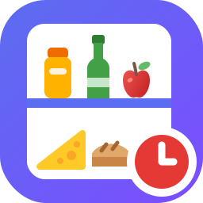

ENGLISH

# 🥫 Smart Home Pantry for Home Assistant

A custom integration to **manage your food pantry** in Home Assistant and keep everything under control:
- **scan the barcode** of a product and add it in seconds
- track **expiry dates**, even with multiple lots of the same product
- know how many products are **expiring** and how many are **expired**
- get a **notification** before food goes bad
- **export** the list of expired products to Excel

> Perfect for anyone who is tired of throwing away forgotten food. Product names come from Open Food Facts: no account, no API key.


[](https://www.buymeacoffee.com/domoticafacile)

[](https://analytics.home-assistant.io/custom_integrations.json)

[](https://www.facebook.com/groups/domoticafacile)
[](https://www.facebook.com/domoticafacile)
[](https://www.youtube.com/@DomoticaFacile-it)

[](https://www.instagram.com/domoticafacile.it)
[](https://www.tiktok.com/@domoticafacile)
[](https://whatsapp.com/channel/0029Vb5qW5O4o7qPGrFbRm1T)

<p align="center">
  
</p>

📣 Do you like this integration? ⭐ Star the repository to support the project!

---

## 🎯 Features

✅ **Barcode scanning** from your phone camera, with the product name from Open Food Facts  
✅ **Product not in the database?** Type the name yourself, it gets saved anyway  
✅ **Lot management**: same product, different expiry dates, kept separate  
✅ **FEFO removal**: when you take an item, the one expiring first goes out  
✅ **Expiry notifications**: persistent in Home Assistant and push to the Companion app  
✅ **Lovelace card included**, registered automatically (no files to copy, no resources to add)  
✅ **Optional sidebar panel**: your pantry full-page in the Home Assistant menu  
✅ **Expired products**: dedicated counter, one-tap cleanup and **Excel export**  
✅ **Two-level thresholds**: warning (orange) and critical (red)  
✅ **Customizable**: date format, sorting, thresholds, menu name  
✅ **Product cache**: lookups are kept for 30 days

<p align="center">

</p>

---

## ⚙️ Installation via HACS

> If you don't have HACS, follow the official guide: https://hacs.xyz

1. Open **HACS**
2. Click the **three dots** in the top-right corner
3. Select **Custom repositories**
4. Copy & paste this repository URL: https://github.com/DomoticaFacile/smart_home_pantry
5. Select **Integration**
6. Click **Add**
7. Find the integration in the HACS list, click it and then install it
8. **Restart Home Assistant**

---

## 🧩 Configuration

After installation:

1. Go to **Settings → Devices & services**
2. Click **Add integration**
3. Search for **Smart Home Pantry**
4. Complete the setup

📌 The whole configuration is done via UI, and options can be changed via the integration **gear icon**.

---

## 🛠️ Available Options (Settings → Integrations → Smart Home Pantry → Options)

### 🔔 Persistent notification (persistent_enabled)
Shows a notification inside Home Assistant when products are expiring or already expired.

### 📱 Push notification (push_enabled)
Sends a push notification to the Companion app.

### 📲 Notify services (notify_services)
Which notify services to use for the push, comma separated.
Example: `mobile_app_my_phone, mobile_app_tablet`

### ⏰ Daily check time (notify_time)
The time of day when the integration checks expiry dates and sends notifications.
One check per day, so you don't get spammed.

### 🟠 Warning days (days_before)
From here a product is considered **expiring** (orange).
Example: 7 → everything expiring within a week gets highlighted.

### 🔴 Critical days (days_critical)
From here a product becomes **urgent** (red).
Example: 2 → the last two days before expiry turn red.

📌 Critical days cannot be higher than warning days: a product cannot be urgent before it is even expiring.

### 📚 Sidebar (sidebar_enabled)
Adds the pantry to the Home Assistant sidebar, full-page, without putting it in a dashboard.

### 🏷️ Sidebar item name (sidebar_title)
How to name the sidebar entry. The title inside the card does not change.

### 📅 Date format (date_format)
- `dd/mm/yyyy` → 22/07/2026
- `yyyy-mm-dd` → 2026-07-22
- `mm/dd/yyyy` → 07/22/2026
- `relative` → "In 3 days"

### ⏳ Next expiry within (next_expiry_within)
The "Next expiry" row in the card only shows up if the closest product expires within this many days.
Useful if you only stock long-life food and don't want a pointless row.

### ⛔ Expired within (expired_within)
For how many days an expired product keeps counting in the card header.
Older ones stay in memory and in the list, but they don't clutter the top.

### 🔀 Sorting (sort_order)
- Nearest expiry first (expired on top)
- Expiring first, expired at the bottom
- Alphabetical (A-Z)
- Running low first (fewest items)
- Most items first

---

## 📟 Sensors created by the integration (what they do)

### 🥫 Smart Home Pantry (`sensor.smart_home_pantry`)
The main sensor. The state is the **total number of items** in the pantry.
The **attributes** hold the full product list, the unique products count and the card settings.

🔧 Useful for: the Lovelace card, advanced templates, custom dashboards.

---

### ⚠️ Expiring Products (`sensor.expiring_products`)
Number of items **expiring** within the warning days.
The attributes contain the list of those products.

🔧 Useful for: triggers and alerts (e.g. notify when > 0).

---

### ⛔ Expired Products (`sensor.expired_products`)
Number of items **already expired**.
The attributes contain the list of those products.

🔧 Useful for: urgent alerts, weekly cleanup automations.

---

### 📅 Next Expiry (`sensor.next_expiry`)
The **nearest expiry date** among the products that are still valid.

🔧 Useful for: a "what expires next" card, or a reminder before going shopping.

---

### 🔢 Products Count (`sensor.products_count`)
Total number of items (duplicates of the same product included).

---

### 🧾 Unique Products (`sensor.unique_products`)
How many **different** products you have (regardless of quantity).

---

### 📷 Last Barcode (`sensor.last_barcode`)
The last barcode you scanned.

---

### 🏷️ Last Product (`sensor.last_product`) and Last Brand (`sensor.last_brand`)
Name and brand of the last product added.

🔧 Useful for: confirmation messages, TTS announcements ("Milk added").

---

## 🃏 The Lovelace card

The card is **registered automatically** by the integration: no file to copy into `www`, no resource to add by hand.

To use it, add a manual card with:

```yaml
type: custom:smart-home-pantry-card
```

The integration options act as defaults, but you can override them per card:

```yaml
type: custom:smart-home-pantry-card
days_before: 5
days_critical: 1
date_format: relative
sort_order: alphabetical
```

From the card you can: scan a product, take items out, remove manually, edit a lot (quantity and/or expiry), clear expired products and export them to Excel.

---

## 🧰 Services

| Service | What it does |
|---|---|
| `smart_home_pantry.scan_barcode` | Adds a product from its barcode |
| `smart_home_pantry.add_product` | Adds a product with name and expiry date |
| `smart_home_pantry.remove_quantity` | Removes N items (from the lot expiring first) |
| `smart_home_pantry.update_lot` | Changes quantity and/or expiry date of a lot |
| `smart_home_pantry.clear_expired` | Removes all expired products |
| `smart_home_pantry.export_expired` | Saves the expired list as an Excel file in `www/` |
| `smart_home_pantry.lookup_barcode` | Looks up a barcode without adding anything |
| `smart_home_pantry.clear_cache` | Clears the Open Food Facts cache |
| `smart_home_pantry.refresh` | Recalculates the counters |
| `smart_home_pantry.clear_pantry` | Empties the pantry |

---

## 📊 Lovelace Dashboard (simple and clean)

The card alone is usually enough, but you can pair it with the summary sensors:

```yaml
type: vertical-stack
cards:
  - type: custom:smart-home-pantry-card
  - type: entities
    title: Pantry overview
    entities:
      - entity: sensor.smart_home_pantry
        name: Total items
      - entity: sensor.unique_products
        name: Different products
      - entity: sensor.expiring_products
        name: Expiring
      - entity: sensor.expired_products
        name: Expired
      - entity: sensor.next_expiry
        name: Next expiry
```

---

## 🍎 Where product names come from

Names and brands come from [Open Food Facts](https://world.openfoodfacts.org), a free and collaborative food database. No account and no API key needed.

If a product is not in the database, the card lets you type the name yourself: it will be saved in your pantry anyway.

📌 Lookups are cached for 30 days, so scanning the same product again is instant and does not hit the server.

---

## 🌍 Quick guide: how to translate Smart Home Pantry into other languages

Home Assistant handles translations using the files inside the `translations/` folder.
The language is automatically selected based on the language set in Home Assistant (Settings → System → General).

✅ Folder structure

```yaml
custom_components/smart_home_pantry/
  translations/
    it.json
    en.json
    de.json
    fr.json
```

1) Add a new language

Create a new file inside `translations/` using the language code:

German: de.json

French: fr.json

Spanish: es.json

Copy the structure from `translations/en.json` into the new file.

Translate only the text values, without changing the keys.

✅ Example:

```yaml
{
  "options": {
    "step": {
      "init": {
        "title": "Smart Home Pantry settings",
        "data": {
          "days_before": "Warning days"
        }
      }
    }
  }
}
```

2) Never change the keys

Keys must match exactly what is used in the code (config flow and options flow).
If a key is missing or different, Home Assistant will show the raw key (e.g. `days_critical`).

3) Troubleshooting

If you see errors like JSONDecodeError, the file is not valid JSON (check commas and braces).

If translations do not appear, verify the file path:

custom_components/smart_home_pantry/translations/[lang].json

---

👨‍💻 Developer

Created with ❤️ by www.domoticafacile.it

Do you have suggestions or want to contribute?
Open an issue, a pull request, or contact us through our social channels listed on the website.

---

📄 License

This project is distributed under the MIT license.
You may use, modify, and distribute it freely, as long as the original copyright is preserved.

Read the LICENSE file for full details.

[](https://www.buymeacoffee.com/domoticafacile)

---
ITALIAN

# 🥫 Smart Home Pantry per Home Assistant

Integrazione personalizzata per **gestire la dispensa di casa** in Home Assistant e tenere tutto sotto controllo:
- **scansiona il codice a barre** di un prodotto e aggiungilo in pochi secondi
- tieni traccia delle **scadenze**, anche con più confezioni dello stesso prodotto
- sai quanti prodotti sono **in scadenza** e quanti sono **scaduti**
- ricevi una **notifica** prima che il cibo vada a male
- **esporti** in Excel la lista dei prodotti scaduti

> Perfetta per chi è stanco di buttare via il cibo dimenticato. I nomi dei prodotti arrivano da Open Food Facts: nessun account, nessuna chiave API.


[](https://www.buymeacoffee.com/domoticafacile)

[](https://analytics.home-assistant.io/custom_integrations.json)

[](https://www.facebook.com/groups/domoticafacile)
[](https://www.facebook.com/domoticafacile)
[](https://www.youtube.com/@DomoticaFacile-it)

[](https://www.instagram.com/domoticafacile.it)
[](https://www.tiktok.com/@domoticafacile)
[](https://whatsapp.com/channel/0029Vb5qW5O4o7qPGrFbRm1T)

<p align="center">
  
</p>

📣 Ti piace questa integrazione? ⭐ Metti una stella al repository per supportare il progetto!

---

## 🎯 Funzionalità

✅ **Scansione del codice a barre** dalla fotocamera, con il nome del prodotto da Open Food Facts  
✅ **Prodotto non nel database?** Scrivi tu il nome, viene salvato lo stesso  
✅ **Gestione a lotti**: stesso prodotto, scadenze diverse, tenute separate  
✅ **Prelievo FEFO**: quando togli un pezzo, esce quello che scade prima  
✅ **Notifiche di scadenza**: persistenti in Home Assistant e push sull'app Companion  
✅ **Card Lovelace inclusa**, registrata automaticamente (niente file da copiare, niente risorse da aggiungere)  
✅ **Pannello nella barra laterale** (opzionale): la dispensa a tutta pagina  
✅ **Prodotti scaduti**: contatore dedicato, azzeramento con un tasto ed **esportazione in Excel**  
✅ **Doppia soglia**: preavviso (arancione) e critica (rosso)  
✅ **Personalizzabile**: formato data, ordinamento, soglie, nome della voce di menu  
✅ **Cache dei prodotti**: i risultati restano in memoria per 30 giorni

<p align="center">

</p>

---

## ⚙️ Installazione tramite HACS

> Se non hai HACS, segui la guida ufficiale: https://hacs.xyz

1. Apri **HACS**
2. Vai sui 3 pallini in alto a destra
3. Clicca su "Archivi digitali personalizzati"
4. Copia e incolla l'indirizzo di questo repo: https://github.com/DomoticaFacile/smart_home_pantry
5. Seleziona "Integrazione"
6. Clicca "Aggiungi"
7. Cerca l'integrazione nell'elenco di HACS, clicca e poi installa
8. **Riavvia Home Assistant**

---

## 🧩 Configurazione

Dopo l'installazione:

1. Vai su **Impostazioni → Dispositivi e servizi**
2. Clicca **Aggiungi integrazione**
3. Cerca **Smart Home Pantry**
4. Completa il setup

📌 La configurazione è tutta via UI e le opzioni sono modificabili dal tasto **ingranaggio** dell'integrazione.

---

## 🛠️ Opzioni disponibili (Impostazioni → Integrazioni → Smart Home Pantry → Opzioni)

### 🔔 Notifica persistente (persistent_enabled)
Mostra un avviso dentro Home Assistant quando ci sono prodotti in scadenza o già scaduti.

### 📱 Notifica push (push_enabled)
Invia una notifica push sull'app Companion.

### 📲 Servizi notify (notify_services)
Quali servizi notify usare per il push, separati da virgola.
Esempio: `mobile_app_mio_telefono, mobile_app_tablet`

### ⏰ Orario del controllo giornaliero (notify_time)
L'ora in cui l'integrazione controlla le scadenze e manda le notifiche.
Un solo controllo al giorno, così non vieni tempestato di avvisi.

### 🟠 Giorni di preavviso (days_before)
Da qui il prodotto è considerato **in scadenza** (arancione).
Esempio: 7 → tutto ciò che scade entro una settimana viene evidenziato.

### 🔴 Giorni critici (days_critical)
Da qui il prodotto diventa **urgente** (rosso).
Esempio: 2 → gli ultimi due giorni prima della scadenza diventano rossi.

📌 I giorni critici non possono superare quelli di preavviso: un prodotto non può essere urgente prima ancora di essere in scadenza.

### 📚 Barra laterale (sidebar_enabled)
Aggiunge la dispensa al menu laterale di Home Assistant, a tutta pagina, senza doverla mettere in una dashboard.

### 🏷️ Nome della voce di menu (sidebar_title)
Come chiamare la voce nella barra laterale. Il titolo dentro la card non cambia.

### 📅 Formato della data (date_format)
- `dd/mm/yyyy` → 22/07/2026
- `yyyy-mm-dd` → 2026-07-22
- `mm/dd/yyyy` → 07/22/2026
- `relative` → "Tra 3 giorni"

### ⏳ Prossima scadenza entro (next_expiry_within)
La riga "Prossima scadenza" compare solo se il prodotto più vicino scade entro questi giorni.
Utile se hai solo scatolame a lunga conservazione e non vuoi una riga inutile.

### ⛔ Scaduti entro (expired_within)
Per quanti giorni un prodotto scaduto continua a essere contato in cima alla card.
I più vecchi restano in memoria e nella lista, ma non affollano l'intestazione.

### 🔀 Ordinamento (sort_order)
- Scadenza più vicina (scaduti in cima)
- In scadenza prima, scaduti in fondo
- Ordine alfabetico (A-Z)
- In esaurimento prima (meno pezzi)
- Più numerosi prima

---

## 📟 Sensori creati dall'integrazione (cosa fanno e a cosa servono)

### 🥫 Smart Home Pantry (`sensor.smart_home_pantry`)
Il sensore principale. Lo stato è il **numero totale di pezzi** in dispensa.
Negli **attributi** trovi l'elenco completo dei prodotti, il conteggio dei prodotti unici e le impostazioni della card.

🔧 Utile per: la card Lovelace, template avanzati, dashboard personalizzate.

---

### ⚠️ Expiring Products (`sensor.expiring_products`)
Numero di pezzi **in scadenza** entro i giorni di preavviso.
Negli attributi c'è l'elenco di quei prodotti.

🔧 Utile per: trigger e avvisi (es. notifica se > 0).

---

### ⛔ Expired Products (`sensor.expired_products`)
Numero di pezzi **già scaduti**.
Negli attributi c'è l'elenco di quei prodotti.

🔧 Utile per: alert urgenti, automazioni di pulizia settimanale.

---

### 📅 Next Expiry (`sensor.next_expiry`)
La **scadenza più vicina** tra i prodotti ancora validi.

🔧 Utile per: una card "cosa scade adesso", o un promemoria prima della spesa.

---

### 🔢 Products Count (`sensor.products_count`)
Numero totale di pezzi (contando anche i doppioni dello stesso prodotto).

---

### 🧾 Unique Products (`sensor.unique_products`)
Quanti prodotti **diversi** hai (a prescindere dalla quantità).

---

### 📷 Last Barcode (`sensor.last_barcode`)
L'ultimo codice a barre scansionato.

---

### 🏷️ Last Product (`sensor.last_product`) e Last Brand (`sensor.last_brand`)
Nome e marca dell'ultimo prodotto aggiunto.

🔧 Utile per: messaggi di conferma, annunci vocali ("Latte aggiunto").

---

## 🃏 La card Lovelace

La card viene **registrata automaticamente** dall'integrazione: nessun file da copiare in `www`, nessuna risorsa da aggiungere a mano.

Per usarla, aggiungi una card manuale con:

```yaml
type: custom:smart-home-pantry-card
```

Le opzioni dell'integrazione valgono come predefinite, ma puoi sovrascriverle nella singola card:

```yaml
type: custom:smart-home-pantry-card
days_before: 5
days_critical: 1
date_format: relative
sort_order: alphabetical
```

Dalla card puoi: scansionare un prodotto, prelevare pezzi, rimuovere manualmente, modificare un lotto (quantità e/o scadenza), azzerare gli scaduti ed esportarli in Excel.

---

## 🧰 Servizi

| Servizio | Cosa fa |
|---|---|
| `smart_home_pantry.scan_barcode` | Aggiunge un prodotto dal codice a barre |
| `smart_home_pantry.add_product` | Aggiunge un prodotto con nome e scadenza |
| `smart_home_pantry.remove_quantity` | Toglie N pezzi (dal lotto che scade prima) |
| `smart_home_pantry.update_lot` | Modifica quantità e/o scadenza di un lotto |
| `smart_home_pantry.clear_expired` | Rimuove tutti i prodotti scaduti |
| `smart_home_pantry.export_expired` | Salva la lista degli scaduti come file Excel in `www/` |
| `smart_home_pantry.lookup_barcode` | Cerca un codice a barre senza aggiungere nulla |
| `smart_home_pantry.clear_cache` | Svuota la cache di Open Food Facts |
| `smart_home_pantry.refresh` | Ricalcola i contatori |
| `smart_home_pantry.clear_pantry` | Svuota la dispensa |

---

## 📊 Dashboard Lovelace (semplice e pulita)

Di solito basta la card, ma puoi affiancarle i sensori di riepilogo:

```yaml
type: vertical-stack
cards:
  - type: custom:smart-home-pantry-card
  - type: entities
    title: Riepilogo dispensa
    entities:
      - entity: sensor.smart_home_pantry
        name: Pezzi totali
      - entity: sensor.unique_products
        name: Prodotti diversi
      - entity: sensor.expiring_products
        name: In scadenza
      - entity: sensor.expired_products
        name: Scaduti
      - entity: sensor.next_expiry
        name: Prossima scadenza
```

---

## 🍎 Da dove arrivano i nomi dei prodotti

Nomi e marche arrivano da [Open Food Facts](https://world.openfoodfacts.org), un database alimentare gratuito e collaborativo. Non serve alcun account né chiave API.

Se un prodotto non è presente nel database, la card ti permette di scrivere il nome a mano: verrà salvato lo stesso nella tua dispensa.

📌 I risultati vengono messi in cache per 30 giorni: riscansionare lo stesso prodotto è immediato e non interroga di nuovo il server.

---

## 🌍 Guida rapida: come tradurre Smart Home Pantry in altre lingue

Home Assistant gestisce le traduzioni tramite i file nella cartella `translations/`.
La lingua usata dipende automaticamente dalla lingua impostata in Home Assistant (Impostazioni → Sistema → Generale).

✅ Struttura delle cartelle

```yaml
custom_components/smart_home_pantry/
  translations/
    it.json
    en.json
    de.json
    fr.json
```

1) Aggiungere una nuova lingua

Crea un nuovo file nella cartella `translations/` con il codice lingua:

Tedesco: de.json

Francese: fr.json

Spagnolo: es.json

Copia la struttura di `translations/it.json` dentro il nuovo file.

Traduci solo i testi (valori), senza cambiare le chiavi.

✅ Esempio:

```yaml
{
  "options": {
    "step": {
      "init": {
        "title": "Impostazioni Smart Home Pantry",
        "data": {
          "days_before": "Giorni di preavviso"
        }
      }
    }
  }
}
```

2) Non cambiare mai le chiavi

Le chiavi devono combaciare esattamente con quelle usate nel codice (config flow e options flow).
Se una chiave non esiste o è diversa, Home Assistant mostrerà il nome grezzo (es. `days_critical`).

3) Troubleshooting

Se vedi errori tipo JSONDecodeError, il file non è un JSON valido (attenzione a virgole e parentesi).

Se le traduzioni non compaiono, verifica il percorso:

custom_components/smart_home_pantry/translations/[lingua].json

---

👨‍💻 Sviluppatore

Realizzato con ❤️ da www.domoticafacile.it

Hai suggerimenti o vuoi contribuire?
Apri una issue, una pull request o contattaci tramite i nostri canali social che trovi sul sito.

---

## 📄 Licenza

Questo progetto è distribuito sotto licenza **MIT**.  
Puoi usarlo, modificarlo e distribuirlo liberamente, purché venga mantenuto il copyright originario.

Leggi il file [LICENSE](LICENSE) per i dettagli completi.

---

❤️ Supporta Domotica Facile

Se questa integrazione ti è stata utile e ti ha fatto risparmiare tempo (e cibo 😄), puoi darci una mano concreta a continuare 💪🏡

Ogni guida, integrazione e test richiede tempo, studio e tanta passione.
Con un piccolo contributo puoi supportare lo sviluppo di nuovi progetti, articoli e integrazioni come questa.

☕ Offrici un caffè e sostieni Domotica Facile

[](https://www.buymeacoffee.com/domoticafacile)

Anche un gesto simbolico fa la differenza.
Grazie di cuore per il tuo supporto ❤️🥫
